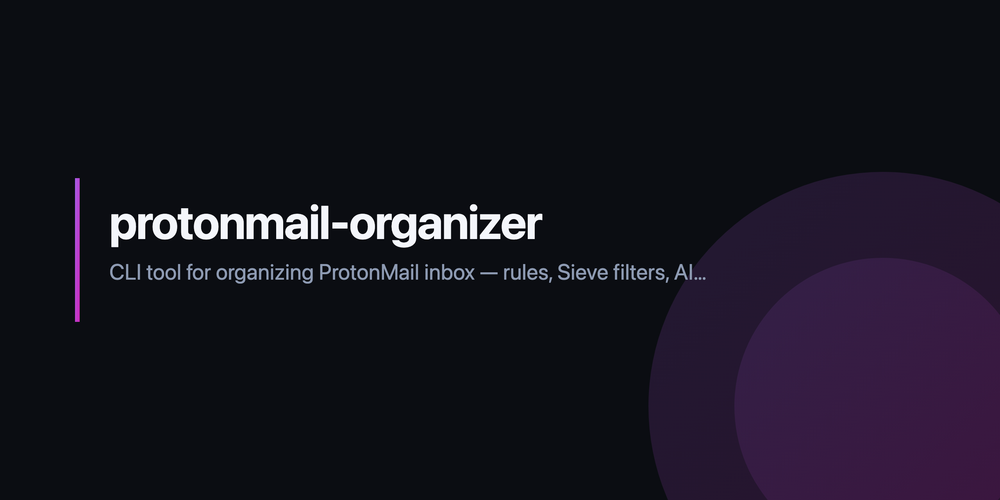

# ProtonMail Organizer

<p align="center">
  
</p>

A command-line tool to organize your ProtonMail inbox: search and bulk-manage
messages, auto-sort with a YAML rule engine, compile rules to server-side Sieve
filters, detect newsletters, draft AI replies in your own writing style, and more.

> **Note**: This is an unofficial tool built on the community
> [`protonmail-api-client`](https://pypi.org/project/protonmail-api-client/).
> It is not affiliated with or endorsed by Proton AG. Use at your own risk, and
> always preview destructive operations with `--dry-run` first.

## Features

- **Messages** — list, search (by sender/recipient/keyword/date/attachments), read, and count.
- **Labels & folders** — list, create, delete, and apply, with free-plan limit guards.
- **Cleanup** — bulk-delete old mail, archive by sender, detect newsletters, empty Trash/Spam, and surface unsubscribe links.
- **Rule engine** — declarative YAML rules (`conditions` → `actions`) run on demand or continuously in `watch` mode.
- **Server-side filters** — compile your YAML rules to ProtonMail-compatible Sieve and push them to your account.
- **AI replies** — draft replies with Claude that match your personal writing style (analyzed from your sent mail).
- **Templates** — reusable reply templates with `{sender_first}`, `{subject}`, and other placeholders.
- **Insights** — account stats, top senders, a daily digest of who's waiting on you, and rule-coverage analytics.

### Experimental features

Some surface area is wider than it is battle-tested. The following are usable but
**experimental** — expect rough edges, and prefer `--dry-run` where available:

- **Writing-style profile** (`pmo respond profile`) — heuristic analysis of your sent mail.
- **Rule analytics** (`pmo rules stats` / `pmo rules suggest`).
- **Templates** (`pmo templates …`).

The dependable core is `messages`, `labels`, `rules run`, `cleanup`, and `filters`.

## Project status

This is a single-author, pre-1.0 tool. To be clear about what the badges *don't*
say: there are no third-party security or "scorecard" badges here, and CI is
deliberately simple — it installs the package and runs `ruff` + `pytest` on
Python 3.9 and 3.12. That is the only quality signal the repo claims.

## Install

Requires Python 3.9+.

```bash
git clone https://github.com/gr8monk3ys/protonmail-organizer.git
cd protonmail-organizer
pip install -e .

# Optional: AI draft replies (pulls in the anthropic SDK)
pip install -e ".[ai]"
```

This installs the `pmo` command.

## Quick start

```bash
# Log in (session is cached at ~/.config/protonmail-organizer/session.dat, mode 0600)
pmo auth login

# See what's in your inbox
pmo messages list

# Account overview + top senders
pmo stats

# Create starter rules, preview them, then apply
pmo rules init
pmo rules run --dry-run
pmo rules run
```

## Command tour

Run `pmo --help` or `pmo <group> --help` for full details.

### Auth
```bash
pmo auth login      # authenticate (prompts for email, password, 2FA)
pmo auth status     # show the currently authenticated account
pmo auth logout     # remove the saved session
```

### Messages
```bash
pmo messages list --folder 0 --limit 20
pmo messages search --from alice@example.com --days 7
pmo messages search -k "invoice" --has-attachments
pmo messages read <message_id>
pmo messages count
```

### Labels
```bash
pmo labels list --type all
pmo labels create --name "Work" --color "#7272a7"
pmo labels create --name "Receipts" --folder
pmo labels apply <label_id> --messages <id1> --messages <id2>
pmo labels delete <label_id>
```

### Cleanup
```bash
pmo cleanup old --days 90 --dry-run        # move mail older than 90 days to Trash
pmo cleanup old --days 90 --permanent      # ...or delete it permanently
pmo cleanup sender --pattern "marketing@"  # archive everything from a sender
pmo cleanup newsletters                    # detect newsletters (add --delete to remove)
pmo cleanup empty-trash --spam             # empty Trash (and Spam) — permanent
pmo cleanup unsubscribe                     # list one-click unsubscribe links
```

Bulk `cleanup old` / `cleanup newsletters` move messages to **Trash** by default
(recoverable) rather than deleting permanently. Every bulk archive/trash is logged
and reversible:

```bash
pmo undo            # reverse the most recent archive / move-to-Trash
pmo undo --list     # show the recent operation history
```

### Rules
```bash
pmo rules init               # write an example rules file
pmo rules list               # show configured rules
pmo rules validate           # check syntax + label references
pmo rules run --dry-run      # preview matches without applying
pmo rules run                # apply actions
pmo rules stats              # rule coverage over your inbox
pmo rules suggest            # suggest new rules for unmatched senders
```

### Server-side filters (Sieve)
```bash
pmo filters preview          # compile your YAML rules to Sieve (no push)
pmo filters push             # compile and upload as a server-side filter
pmo filters list             # show active server-side filters
pmo filters pull             # download and print existing Sieve scripts
pmo filters delete <id>      # remove a filter (or --all)
```

### AI replies & templates
```bash
pmo respond profile --refresh         # analyze your sent mail to learn your style
pmo respond to <message_id>           # draft a reply (review → send/draft/edit/regenerate)
pmo respond to <message_id> --model claude-sonnet-4-6
pmo respond interactive               # pick a message from the inbox, then draft

pmo templates create thanks
pmo templates list
pmo templates use thanks <message_id>
```

Replies are **threaded** onto the original conversation (the original message is
quoted beneath your reply). At the review step you can **send** immediately or
**save as a draft** in ProtonMail to review and send from the web/app.

AI replies run on one of two backends, selected with `PMO_AI_BACKEND`.

**Cloud (Anthropic, default).** Highest quality, but the email content leaves
your device (see [privacy](#what-leaves-your-device-when-you-use-ai-replies)):

```bash
export ANTHROPIC_API_KEY="sk-ant-..."
export PMO_AI_MODEL="claude-sonnet-4-6"   # optional, default: claude-opus-4-8
```

**Local (private).** Point at any OpenAI-compatible server — Ollama, LM Studio,
llama.cpp, vLLM — so **nothing leaves your machine** and no egress acknowledgment
is needed. With [Ollama](https://ollama.com):

```bash
ollama serve && ollama pull llama3.1
export PMO_AI_BACKEND=local
export PMO_AI_MODEL=llama3.1                       # optional, default: llama3.1
export PMO_AI_BASE_URL=http://localhost:11434/v1   # optional, this is the default
# export PMO_AI_API_KEY=...                         # only if your server needs a token

pmo respond to <message_id> --backend local        # or set PMO_AI_BACKEND once
```

`--backend anthropic|local` overrides the env var per command. A local backend
on `localhost` is treated as private; pointing `PMO_AI_BASE_URL` at a remote host
re-enables the egress acknowledgment.

### Watch, digest & organize
```bash
pmo watch --interval 60      # poll the inbox and auto-apply rules continuously
pmo digest --days 1          # summary of recent activity + who's waiting on you
pmo organize                 # interactive menu-driven mode
```

## Rules format

Rules live at `~/.config/protonmail-organizer/rules.yaml` (or pass `--file`).
Each rule is a set of `conditions` (all must match — AND logic) and `actions`.

```yaml
rules:
  - name: "Label GitHub notifications"
    conditions:
      sender_domain: "github.com"
    actions:
      add_label: "GitHub"
      mark_read: true

  - name: "Delete old unread newsletters"
    conditions:
      sender_contains: "newsletter"
      older_than_days: 60
      unread: true
    actions:
      delete: true
```

**Conditions:** `sender_is`, `sender_contains`, `sender_domain`, `subject_contains`,
`sender_matches` / `subject_matches` (case-insensitive regex), `has_attachment`,
`older_than_days`, `unread`.

Any text condition accepts a **list** of values, matching if *any* of them match
(OR within the condition; conditions are still AND-ed together):

```yaml
  - name: "Label code-hosting notifications"
    conditions:
      sender_domain: ["github.com", "gitlab.com", "bitbucket.org"]
    actions:
      add_label: "Code"
```

**Actions:** `move_to`, `add_label`, `remove_label`, `mark_read`, `delete`, `archive`, `star`.

Run rules against any folder, not just the inbox: `pmo rules run --folder 6` (Archive).

Time-based conditions like `older_than_days` only work with `pmo rules run` /
`pmo watch` (they can't be expressed in Sieve), so `pmo filters push` will skip
or partially compile those rules and tell you which.

## Configuration & privacy

- All state lives under `~/.config/protonmail-organizer/` (override with `PMO_CONFIG_DIR`).
- The session file, style profile, and consent record are written with `0600` permissions.

### What leaves your device when you use AI replies

This matters because ProtonMail is end-to-end encrypted, but the cloud AI backend
is not. With the default Anthropic backend, running `pmo respond …` **decrypts and
sends to the Anthropic API**:

- the **full body of the email you are replying to** (HTML stripped to plain text), and
- **truncated snippets** of your sent mail (first ~3 sentences, capped at 200 chars)
  that make up your writing-style profile.

Do not use the cloud backend on confidential mail you do not want shared with a
third-party provider. Delete `style_profile.json` to remove the stored snippets.
Everything else (`pmo messages`, `rules`, `cleanup`, `filters`, …) stays between
your machine and ProtonMail.

**To keep AI replies fully on-device, use a local model** (`PMO_AI_BACKEND=local`) —
see [AI replies & templates](#ai-replies--templates). Nothing is sent off your
machine, and the egress acknowledgment is skipped automatically.

### Risk acknowledgments

Because this is an unofficial client and AI drafting sends data off-device, the
first time you authenticate (and the first time you draft an AI reply) you are
asked to acknowledge the risk once. The choice is saved in `consent.json`. For
non-interactive use (scripts, CI), set `PMO_ACCEPT_RISKS=1` to accept up front.

### Troubleshooting

This tool rides on a private, undocumented API that can change without notice.
If a command fails with a short error, re-run it with `PMO_DEBUG=1` to print the
full traceback — useful for spotting when the upstream API shape has shifted.

## Development

```bash
pip install -e ".[test]"
pytest                 # run the test suite
ruff check .           # lint
ruff format .          # format
pre-commit install     # enable hooks (ruff, ruff-format, hygiene checks)
```

## License

MIT — see [LICENSE](LICENSE).
